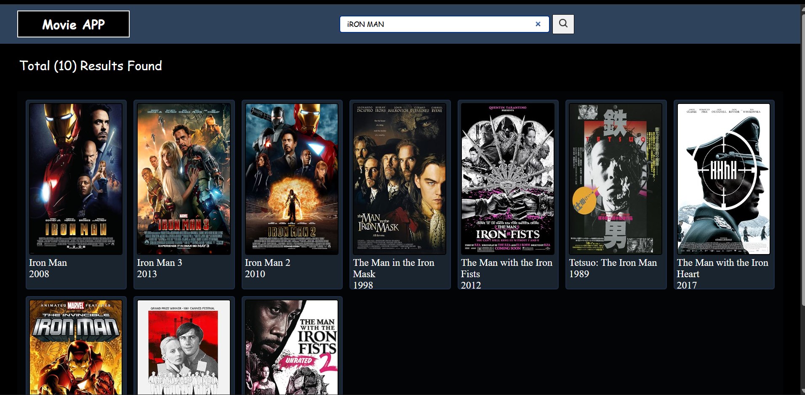

#  Movie Search App

A simple and interactive Movie Search web application built using HTML, CSS, and JavaScript.  
This app allows users to search for movies and view details using an external API.

---

##  Features

-  Search movies by title
-  Display movie results dynamically
-  Show movie details like title, poster, and year
-  Fast API-based search (OMDB API)
-  Responsive UI for mobile and desktop

---

##  Tech Stack

- HTML5
- CSS3
- JavaScript (ES6+)
- Fetch API
- OMDB API

---

## Screenshots

## Mobile Responsive UI  

