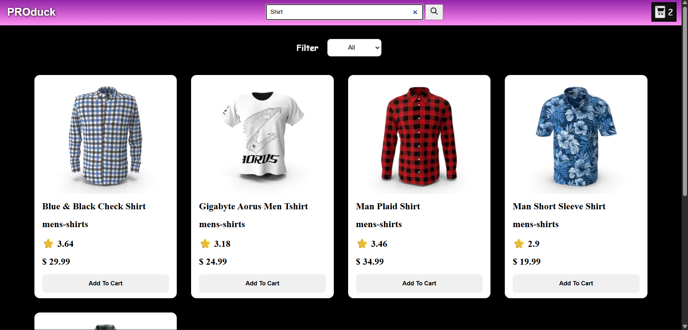
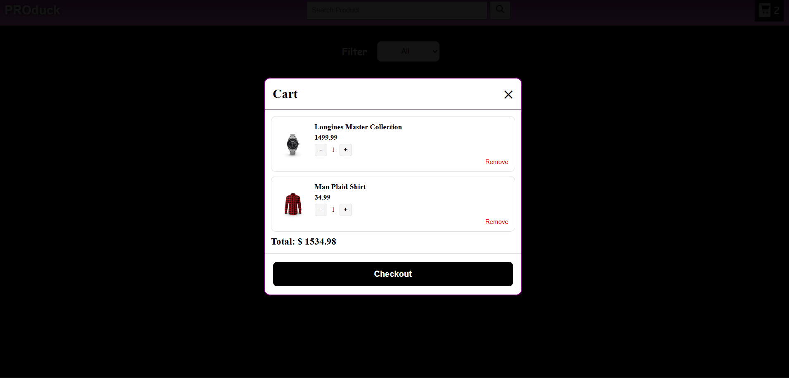
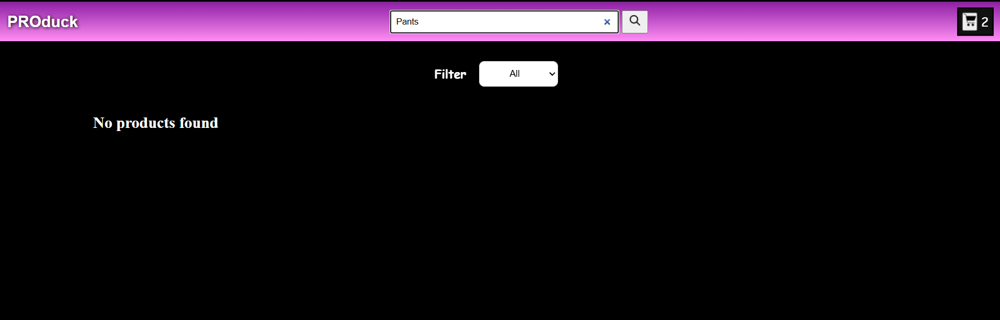

# Product Catalog App

## Project Description: 
A responsive product catalog web application that allows users to browse, search, and filter products. Users can also add items to a cart and manage quantities. The project focuses on dynamic UI updates using JavaScript and API integration.

# Features :

- Search Products
- Filter products by price
- Add to cart functionality
- increase/decrease quantity
- Remove items from cart
- Cart data is stored in localStorage
- Cart count changes on increase and decrease 
- Fully responsive 

# Concepts Used :

- DOM Manipulation
- Event Handling
- Array Methods 
- (map filter, find, reduce)
- Fetch API / Async-Await
- LocalStorage
- Spread Operator
- Conditional Rendering
- Dynamic HTML generation

# Tech Stack :
- HTML5
- CSS3
- JavaScript (ES6+)
- DummyJSON API (or your API name)

# Screenshots :

