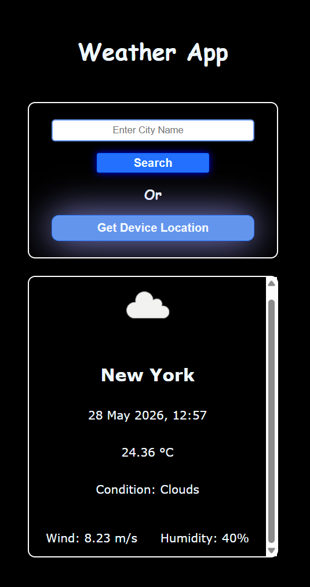
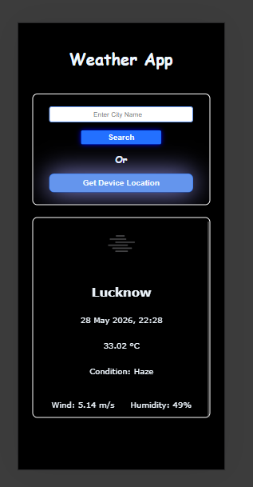

#  Weather App

A simple and responsive Weather Web Application built using HTML, CSS, and JavaScript.  
This app fetches real-time weather data using an external Weather API and displays current weather conditions for any city.

---

##  Features

- Search weather by city name
- Display temperature in real-time
- Show weather conditions (Clear, Rain, Clouds, etc.)
- Humidity information
- Wind speed display
- Fast API-based data fetching
- Responsive design for mobile and desktop

---

## Tech Stack

- HTML5
- CSS3
- JavaScript (ES6+)
- Fetch API
- OpenWeather API

---

##  Screenshots

 
\
