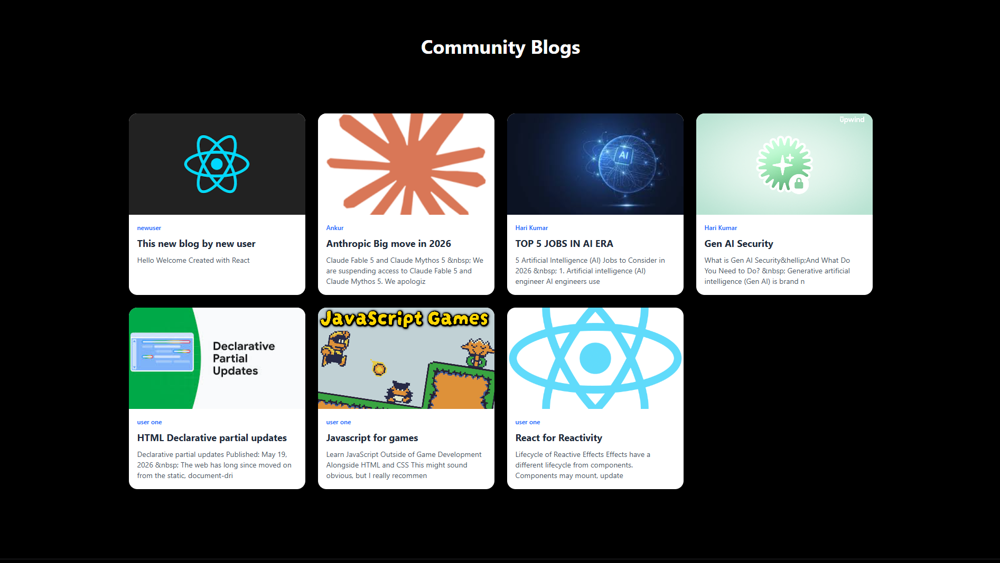
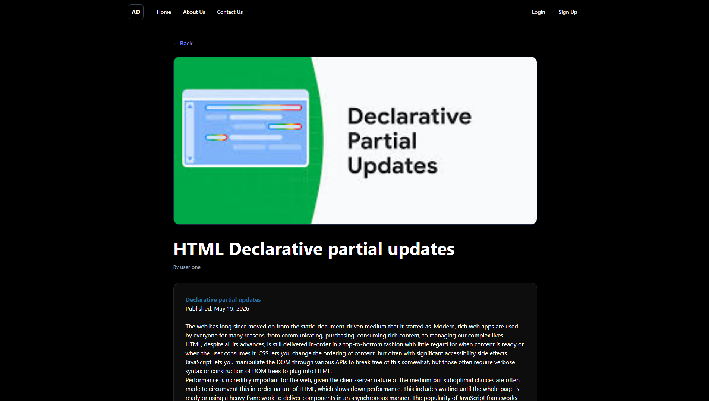

# Full Stack Blog & News Platform

A modern web application that combines community blogging with real-time news updates. Users can create, manage, edit, and delete their own blog posts while also exploring the latest news articles fetched from an external API.

The project is built using React for the frontend and Appwrite for authentication, database management, and file storage.

---

## Features

### Authentication
- User Registration
- Secure Login & Logout
- Session Management
- Protected Routes

### Blog Management
- Create New Blog Posts
- Edit Existing Posts
- Delete Posts
- Upload Featured Images
- Rich Text Editor Support

### Community Blogs
- Browse Posts Shared by Other Users
- Dedicated Community Blog Section
- Dynamic Blog Cards

### Personal Dashboard
- View Your Own Posts
- Manage Published Content
- Quick Access to Edit and Delete Actions

### News Integration
- Fetch Latest News from an External API
- Display Trending Articles
- Separate News and Community Content Sections

### User Interface
- Responsive Design
- Modern Hero Section
- Conditional Navigation Based on Authentication Status
- Clean and User-Friendly Layout

---

## Tech Stack

### Frontend
- React.js
- React Router DOM
- Redux Toolkit
- React Hook Form
- Tailwind CSS

### Backend & Services
- Appwrite Authentication
- Appwrite Database
- Appwrite Storage

### External APIs
- News API

---

## Key Learnings

Through this project, I gained practical experience with:

- Authentication and Authorization
- State Management using Redux Toolkit
- CRUD Operations
- API Integration
- File Upload Handling
- Route Protection
- Form Validation
- Responsive UI Development
- Component-Based Architecture

---

## Future Improvements

- Search Functionality
- Categories and Tags
- User Profiles
- Comments System
- Like and Bookmark Features
- Dark Mode Support
- Pagination and Filtering

---

## Author

**Anuj Dixit**

BCA Student | Aspiring Full Stack Developer

This project was built to strengthen my understanding of full-stack web development, authentication systems, state management, and real-world CRUD operations.

## Screenshots

  
  

  
  

  
  

  

