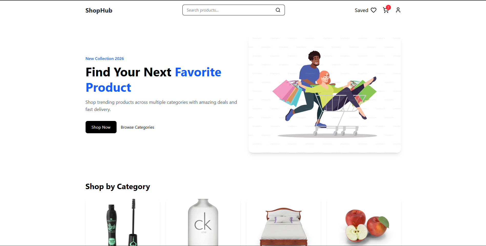
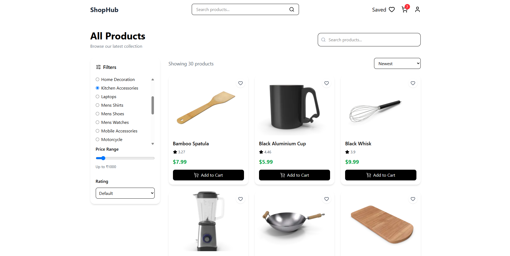
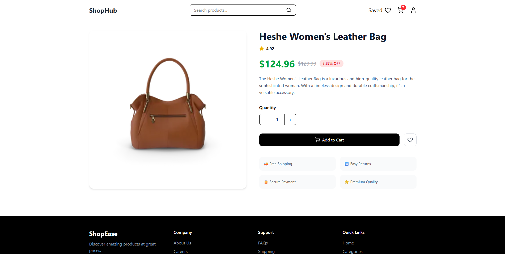
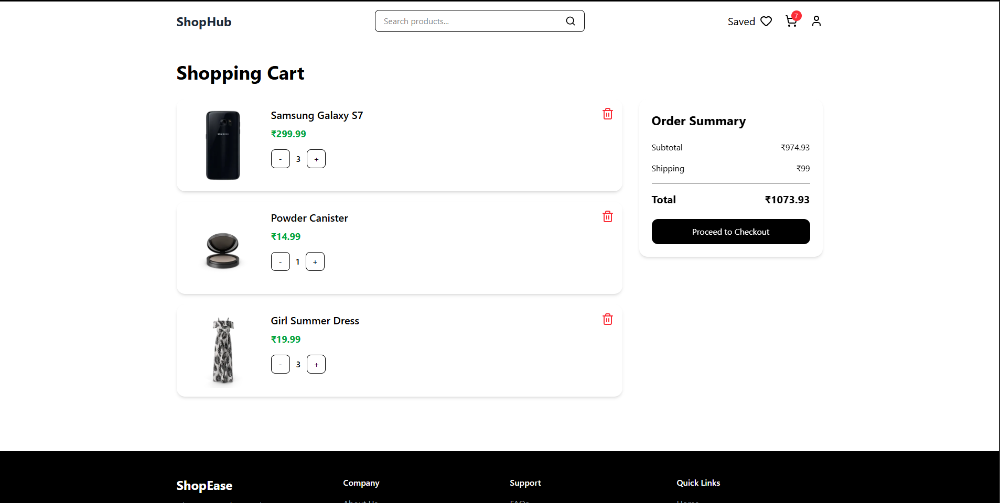
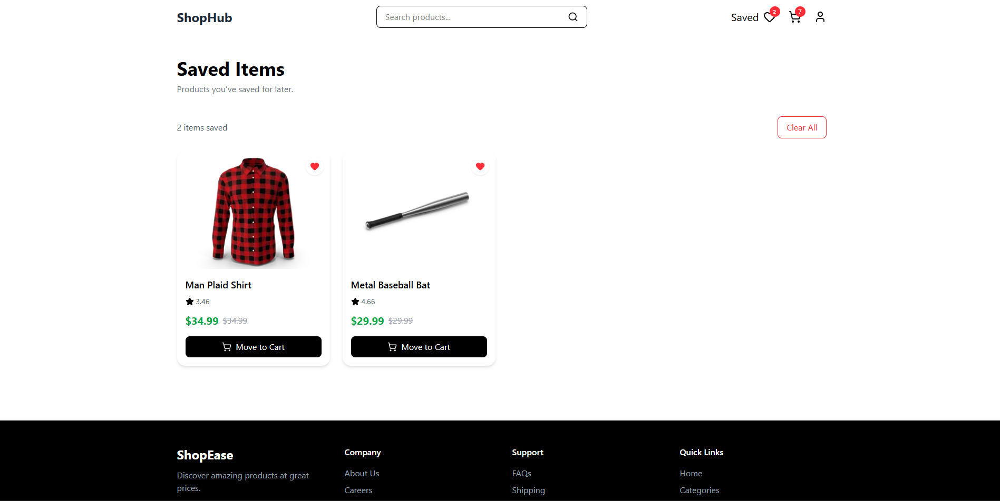

# 🛍️ React E-Commerce Store

A modern and responsive e-commerce frontend built with **React**, featuring dynamic product browsing, filtering, cart management, wishlist functionality, and a clean shopping experience.

## 📸 Screenshots

### 🏠 Home Page

---

### 🛍️ Products

---

### 📦 Product Details

---

### 🛒 Shopping Cart

---

### ❤️ Wishlist

---

## ✨ Features

### 🏠 Home Page
- Hero section
- Shop by Categories
- Best Deals section
- Featured Products
- Smooth scroll navigation

### 🛒 Products
- Browse all products
- Search products
- Category filtering
- Price range filter
- Sort by:
  - Best Rated
  - Price: Low → High
  - Price: High → Low
- Dynamic URL search parameters

### 📦 Product Details
- Product information
- Discount display
- Quantity selector
- Add to Cart
- Save to Wishlist

### ❤️ Wishlist
- Save products
- Remove products
- Move to Cart
- Clear Wishlist
- Wishlist badge in header

### 🛍️ Shopping Cart
- Add products
- Remove products
- Increase/Decrease quantity
- Quantity selection from Product Details
- Cart badge in header

### 💡 User Experience
- Responsive design
- Loading states
- Empty states
- Toast notifications
- LocalStorage persistence
- Smooth scrolling

---

## 🛠️ Tech Stack

- React
- React Router DOM
- Context API
- useReducer
- Tailwind CSS
- DummyJSON API
- Lucide React Icons
- React Hot Toast

---

## 📖 What I Learned

During this project I practiced:

- Building reusable React components
- State management using Context API
- Managing complex state with useReducer
- Client-side routing with React Router
- API integration
- Search, filtering and sorting
- LocalStorage persistence
- Responsive UI design
- Component composition and project structure

---

## 📌 Future Improvements

- User Authentication
- Checkout Flow
- Payment Integration
- Order History
- Product Reviews
- Dark Mode

---

## 👨‍💻 Author

**Anuj Dixit**
---

⭐ If you like this project, consider giving it a star!