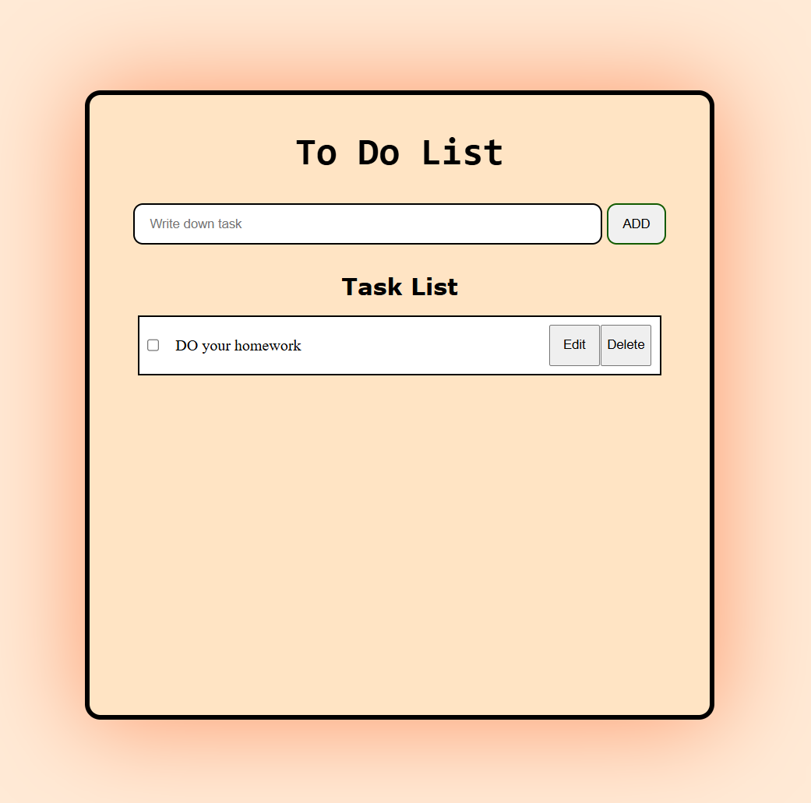
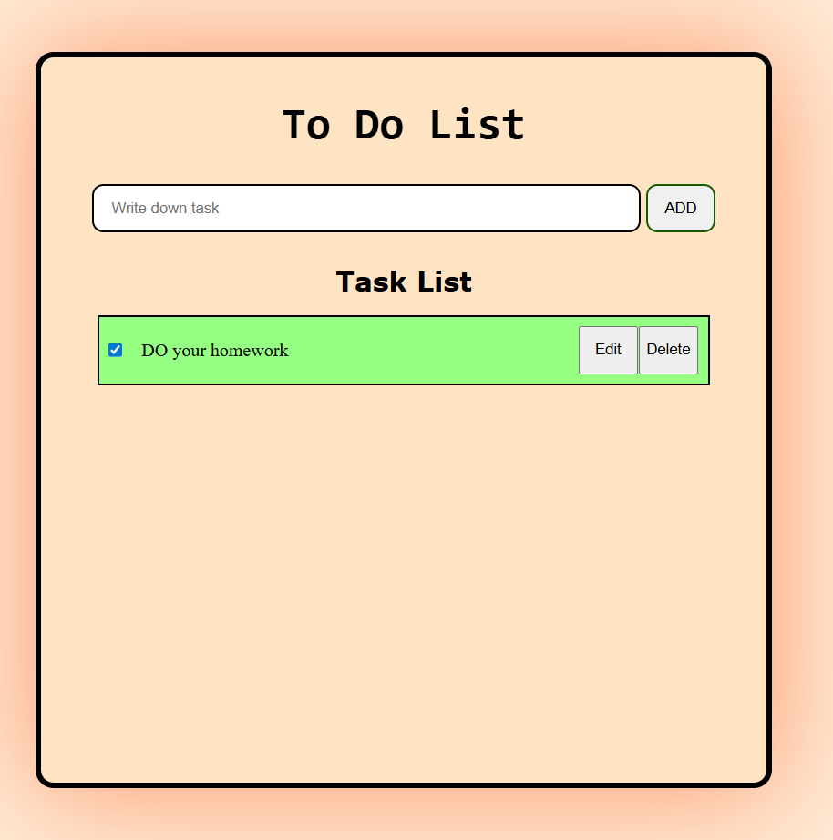
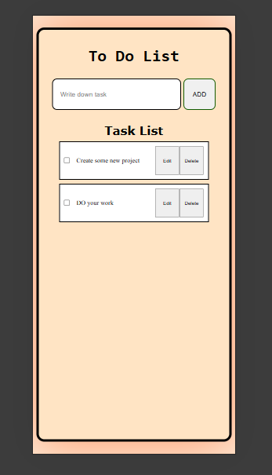

# Todo List App

A simple and interactive Todo List web application built using HTML, CSS, and JavaScript.  
This project helps users manage their daily tasks efficiently by adding, viewing, and deleting tasks.

---

##  Features

-  Add new tasks
-  Delete tasks
-  Mark tasks as completed (if implemented)
-  Save tasks using LocalStorage (if implemented)
-  Responsive design for mobile and desktop

---

##  Tech Stack

- HTML5
- CSS3
- JavaScript (ES6+)
- LocalStorage (if used)

---

##  Screenshots

